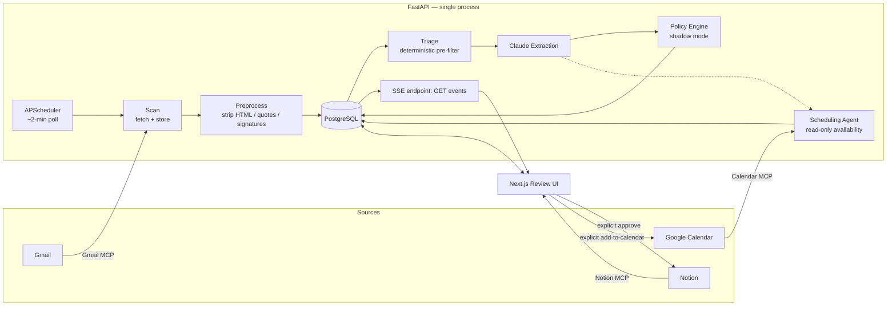

# Inbox-to-Action

Gmail is where work arrives. Notion is where work gets tracked. Nothing bridges them automatically — so tasks buried in email either get manually copied over or forgotten.

Inbox-to-Action is that bridge. It watches a Gmail inbox, uses Claude to figure out which emails actually contain a request directed at you, and shows you a clean queue of candidate tasks. You approve, edit, or dismiss each one. **Only on explicit approval does anything get written to Notion.** The system never acts on your inbox by itself.

```text
Gmail  →  preprocess  →  Claude extraction  →  task candidate  →  you review it  →  Notion
                                                                        ↑
                                                          approve / edit / dismiss
```

## Why this exists

A client emails: *"Can you also update the pricing page by Friday?"* The action is buried inside a normal-looking email. It gets missed, or someone has to manually re-type it into a task tracker. Inbox-to-Action closes that gap without becoming a new task manager — Gmail and Notion stay exactly where they are; this is the intelligence layer in between.

## What makes this different from "connect an LLM to your inbox"

An inbox is one of the few places where untrusted, adversarial-by-default text (email content from strangers) gets piped directly into an LLM. That's the actual hard problem here, not the CRUD app around it. A few things this project does about it:

- **Human approval is structurally required, not just a UI convention.** There is exactly one place in the codebase that can write to Notion (`POST /candidates/{id}/approve`), and it's the only code path that ever calls Notion's API. There's no `AUTO_ACT_ENABLED` flip reachable from anywhere else. Same for Calendar — booking a meeting is a separate, explicit action from approving a task, never bundled together.
- **Prompt-injection resistance is a designed boundary, not an afterthought.** Email content is passed to Claude inside explicit `<email_content>` tags with a system-prompt instruction to treat everything inside as untrusted data to *analyze*, never as instructions to *follow*. The model is asked to flag suspected injection attempts (`injection_suspected`) as a distinct output field.
- **A deterministic sender-trust check catches what content-level defenses can't.** A well-formed, high-confidence, perfectly-worded request from a spoofed identity (e.g. a display name styled like an internal corporate directory entry, on a free webmail domain, with no connection between the two) will sail past any content-based injection check — because the content itself isn't malicious, the *identity* is. `app/sender_trust.py` catches that pattern independently and is a hard override in the policy engine, regardless of how confident the extraction was.
- **Claude never touches dates, identities it wasn't given, or IDs.** It extracts a deadline as a *phrase* ("Friday") — resolving that into an actual calendar date is a deterministic function using the email's timestamp and the user's timezone, done entirely outside the model. Gmail links are built by the backend from IDs the Gmail API returned; the model is never asked to produce one. It's told explicitly not to infer a person's identity from "you" — an assignee is only ever set when a name is actually written in the email.
- **Confidence gates visibility and action separately, and conservatively.** `CONFIDENCE_THRESHOLD` decides what's even worth showing you; a much higher, separate `AUTO_CONFIDENCE_THRESHOLD` gates a *shadow-mode-only* auto-approval policy engine that currently creates nothing on its own — it computes and logs what it *would* do, so the decision logic can be evaluated against real traffic before it's ever allowed to act.

## Architecture



Gmail, Notion, and Calendar are each reached through a small, purpose-built MCP server (`mcp_servers/`) that the backend spawns as a local subprocess over stdio — no new network service per integration, and each server exposes only the two or three tools the pipeline actually needs (e.g. Calendar's server exposes `list_events` and `create_event`, nothing broader).

Everything runs as one FastAPI process (see `app/main.py`). The ~2-minute Gmail poll (`app/scheduler.py`) is an in-process scheduled job that calls the *exact same* scan/extract functions a manual trigger uses — there's one pipeline implementation, not a duplicated "automatic" version and a "manual" version that can drift apart.

## Tech stack

| Layer | Choice | Why |
| --- | --- | --- |
| Backend | FastAPI, single process | The pipeline is a sequence of function calls, not a service mesh — there's no reason for it to be one yet |
| AI | Claude API, structured JSON output | Well-designed prompt + structured output over anything fancier; no fine-tuning, no RAG |
| Scheduling | APScheduler (in-process) | A recurring job inside the process that's already running, not a new Celery/Redis stack |
| Database | PostgreSQL + SQLModel | Plain relational schema — six tables, no ORM magic |
| Email/Calendar/Notion | MCP servers over stdio | Each integration is a small, auditable local subprocess with a minimal tool surface |
| Frontend | Next.js (App Router) + React, no UI framework | Small enough not to need one; CSS Modules over the existing design tokens |
| Live updates | Server-Sent Events | One-directional server→client notifications don't need a WebSocket |

## Data model

`users → email_accounts → emails → task_candidates → user_decisions / notion_tasks / calendar_bookings`

Two fields on `task_candidates` are easy to conflate and deliberately aren't: `deadline_phrase` is exactly what Claude extracted ("Friday"), set once and never touched again; `resolved_due_date` is the deterministic, backend-computed calendar date derived from that phrase plus the email's timestamp and the user's timezone — nullable, because guessing wrong is worse than leaving it blank. `user_decisions` is a separate, append-only log of what a human actually did with each candidate, kept distinct from `task_candidates.status` specifically so it survives as a clean dataset for evaluating and improving extraction quality later.

## Running it locally

**Prerequisites:** Python 3.11+, Node 18+, Docker (for Postgres), a Claude API key, Google OAuth credentials, and a Notion integration token + database ID.

```bash
# 1. Install dependencies
pip install -r requirements.txt
cd web && npm install && cd ..

# 2. Configure environment
cp .env.example .env                          # fill in ANTHROPIC_API_KEY, GOOGLE_CLIENT_ID/SECRET, NOTION_*, USER_TIMEZONE
cp web/.env.local.example web/.env.local       # default (http://localhost:8000) is fine unless the backend runs elsewhere

# 3. Start Postgres
docker compose up -d

# 4. Start the backend (also starts the ~2-minute auto-poll scheduler)
uvicorn app.main:app --reload

# 5. Start the review UI (separate terminal)
cd web && npm run dev
```

Open `http://localhost:3000`, connect Gmail via the login flow, and the pipeline runs on its own from there — a "Scan Gmail now" / "Extract tasks now" pair of buttons is also available for on-demand testing without waiting for the next poll.

## Validating extraction quality

Before any of the surrounding infrastructure was built, extraction accuracy was tested in isolation — a standalone script (`phase1_extraction/`) with no FastAPI, database, or OAuth dependency, run against a small hand-labeled set of real emails. That's deliberate: extraction quality is the actual risk in a project like this, not the CRUD around it.

```bash
python phase1_extraction/run_experiment.py
```

Current result on the 15-email hand-labeled set: **100% precision and recall** on the actionable/not-actionable classification (0 false positives, 0 false negatives). That's a small evaluation set, not a claim of production-scale accuracy — but it's a real, reproducible number, not a target. Later phases each added their own regression check against this same baseline (`phase1_extraction/run_adversarial_eval.py` for prompt-injection resistance, `run_v25_eval.py` and `run_v26_eval.py` for the correction-learning and scheduling additions) to catch a change that improves one thing while quietly breaking another.

## Design process

See [`CHANGELOG.md`](CHANGELOG.md) for what shipped in each phase. Every phase past the initial MVP was designed before it was built — `DESIGN_DECISIONS_V2.1.md` through `V2.7.md` at the repo root each lay out the specific questions a phase raised (build vs. adopt an integration, what a "trust policy" should actually gate, how prompt-injection defense changes the rollout order of an otherwise-approved feature) and the reasoning behind each call, ahead of writing any code for it. `CLAUDE.md` captures the standing constraints those decisions operate inside — precision over recall, no background infrastructure until a phase genuinely needs it, nothing auto-created without a human in the loop.

## Explicitly out of scope (for now)

Slack/Docs ingestion, meeting transcripts, team-wide commitment tracking, semantic deduplication, fine-tuned models, and general "AI chief of staff" functionality are deliberate non-goals for this stage, not oversights — see `docs/spec.md` §13 for the fuller list. The MVP bar is narrower and concrete: a real Gmail email arrives, the system identifies the right action, a human approves it, and it shows up in Notion with correct context and a working link back to the original email.

## License

See [`LICENSE`](LICENSE).
